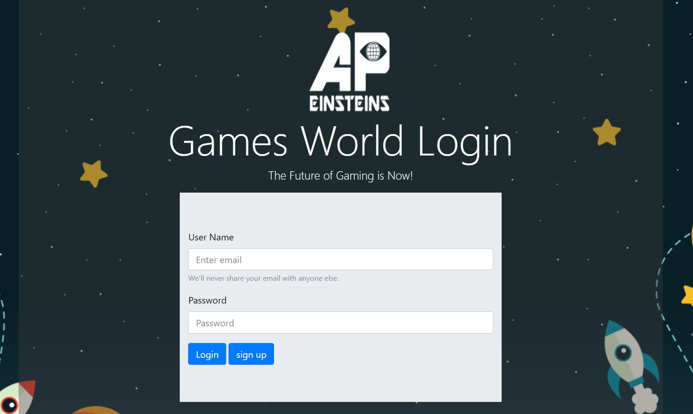
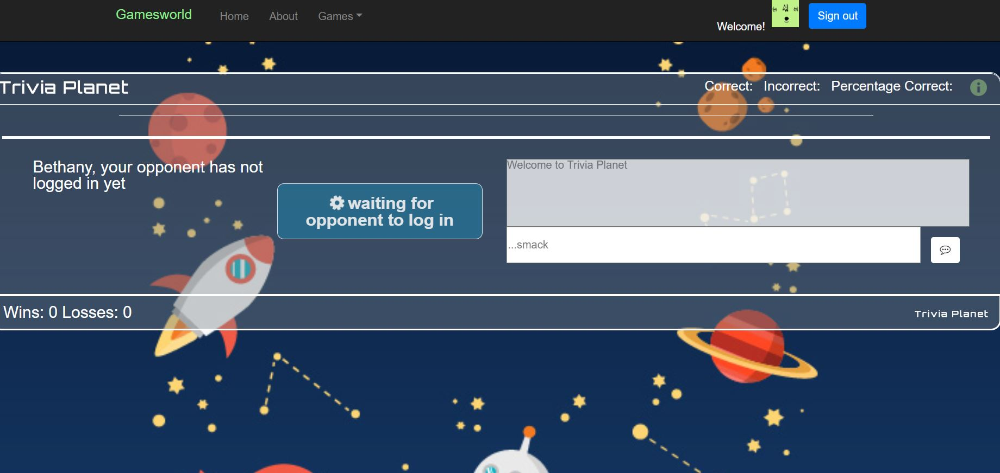
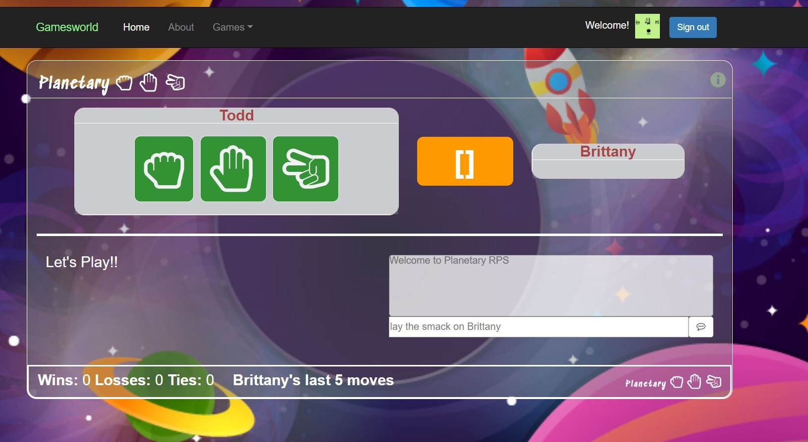
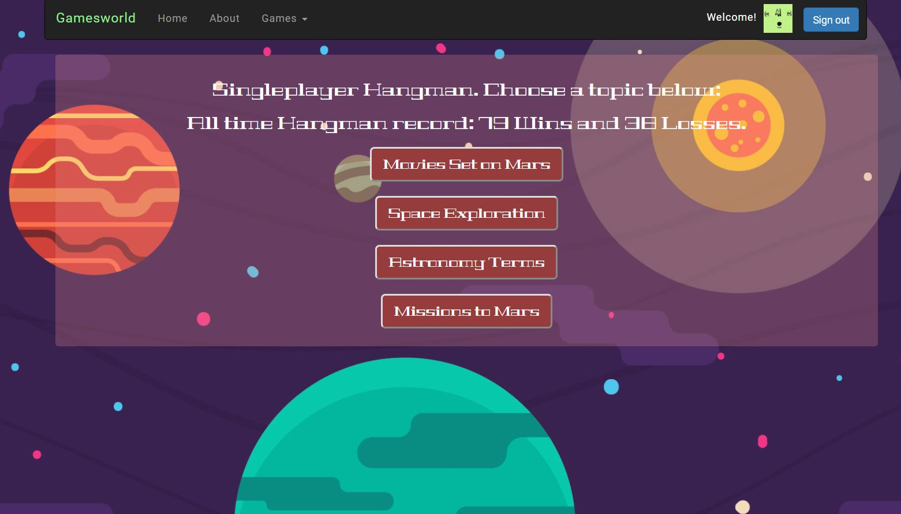
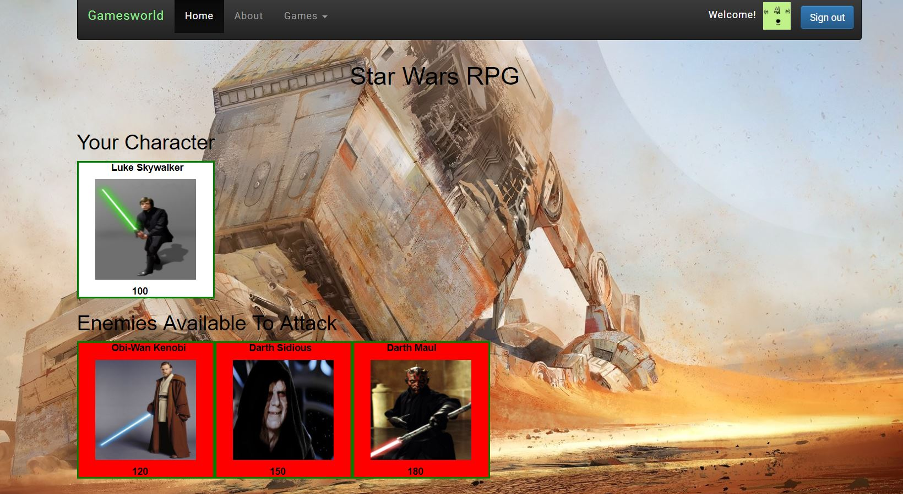

# GamesWorld

Interactive multiplayer and single player gaming website
https://tdsteph1.github.io/GamesWorld/

## Overview

Motivation and Technologies Used:
*Create an entertainment website with social interaction in a fun space theme
*To utilize modern web development technologies within the app

APIs used:
*SWAPI – Star Wars API
*Opentdb.com – multi-category trivia API
*Giphy API –fun gifs

Other Technologies Used:
*Sweetalerts I and II (for modals)
*Fontawesome (icons)
*Bootstrap 3 & 4
*Javascript, AJAX, jQuery
*Firebase

### Login Page

Firebase authentication.  Create a username and password and it will be stored in firebase.

### Landing Page

*From here, the user can click on a planet to pick a game to play.

### Trivia Planet

*Test your trivia knowledge! Pick a trivia topic and play with another user online!

### RPS Planet

*Play rock paper scissors with another player online!

### Hangman Planet

*Choose a nifty space topic and exercise your word-guessing skills on Hangman Planet!

### Star Wars Battle Planet

*Pick a character and battle other Star Wars characters. Defeat them all without losing all your hp to win!

## Authors

* **Kui Eugenio** 
* **TJ Stephens** 
* **Daniel Dito** 
* **Bethany Pfeister** 

## Acknowledgments

* UA Programming Bootcamp
